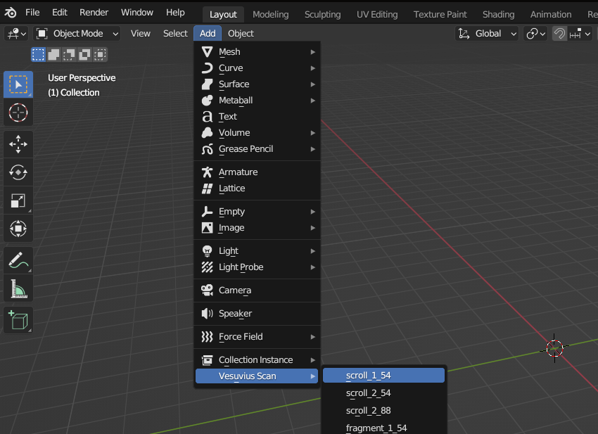
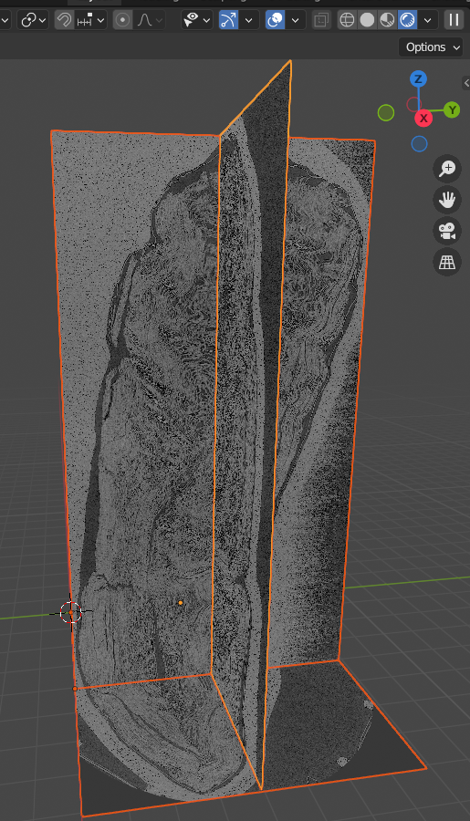
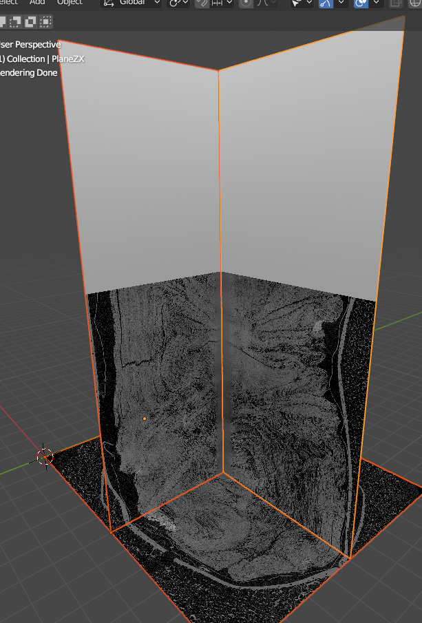
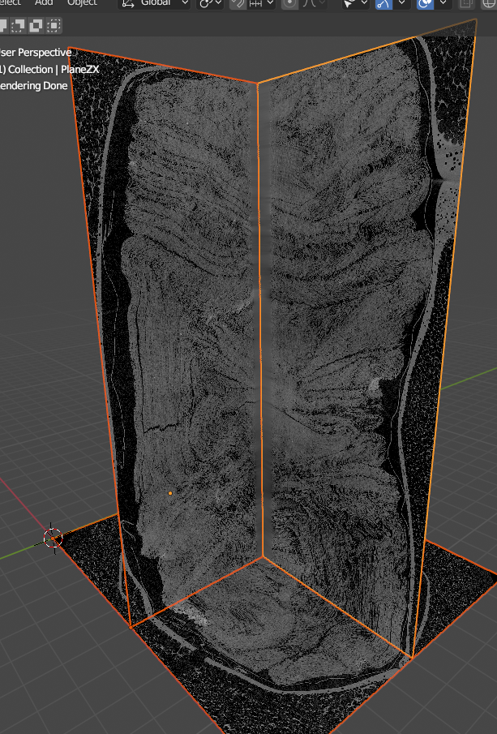

# vesuvius-blender

Explore the X-ray scans from the vesuvius challenge in blender.


## How it works

The 3d tif files produced by [vesuvius-build](https://github.com/spelufo/vesuvius-build)
are loaded as 3d textures, using blender's Cycles renderer, which works live on
the viewport in "rendered" mode.

The blender files here have a material that uses [OSL](https://docs.blender.org/manual/en/latest/render/shader_nodes/osl.html)
to sample the 3d tif files from the position in the blender scene.

Any geometry you model and assign this material will slice through the volumetric data.


## Units

```
1 blender unit/meter = 100 voxels.
5 blender units/meters = 500 voxels = 1 grid cell.
```

## Setup

### Install the addon.

To install the addon the `vesuvius` directory of this repo needs to be put in
Blender's `addons` directory.

My prefered way of doing it, for ease of development, is using a symlink:

```bash
git clone https://github.com/spelufo/vesuvius-blender
addon_dir="$(pwd)/vesuvius-blender/vesuvius"
cd ~/.config/blender/*/scripts/addons/  # linux
# cd ~/Library/Application\ Support/Blender/*/scripts/addons  # osx
ln -s "$addon_dir"
```

You can also do it within Blender. Go to `Edit > Preferences > Add-ons > Install add-on`
and choose the `vesuvius` folder from where you've downloaded it.

If something goes wrong, it helps to have started blender from a terminal,
since errors and print statements from addons will be printed there.

### Enable and configure the data directory

You must have the textures downloaded in a data directory structured like the one
in the [server](https://scrollprize.org/data). You won't need all the data
downloaded right away. The bare minimum is the `_small.tif` file to navigate the
scan in low resolution. I plan to make the addon download the full-res grid
files as needed if they are not present. For now it needs to be done separately.

Open `Edit > Preferences`, `Add-ons`, and search for 'Vesuvius'.

Enable it with the tick, and unfold the preferences by clicking the drop down
triangle. Set the "Path to data directory".

### Add a scan

Create a new blender file, delete the default cube, and add a "Vesuvius Scan"
from the 3d viewport's Add menu `Shift+A` in object mode. In the add menu you'll
see a drop down with all the scans.

This will setup a material, shader and geometry to get started with a scan.


Hit `Home` to zoom out to encompass the created planes.

Set the "Viewport Shading" to "Rendered" by clicking on the fourth sphere icon on
the viewport's top right corner. The addon configures the scene to use cycles
and OSL, which is required.





Adding a scan will also start downloading the `_small.tif` file in a background
thread, if you didn't have it. There's no error checking or progress reporting
of this yet, delete the file and download it manually if you run into problems.
Since these files can be a few GB in size, on linux you'll see the part of the
file that's been downloaded appear on the meshes. Toggling the viewport shading
mode updates the texture.




## Modeling / Sculpting / Segmentation?


I've tried some modeling of the sheets. The poly build tool is quite efficient,
but still a lot of work. You can use the live rendered mode as feedback because
the face you are modeling will light up when aligned to the sheet.

A very good way to try to gain insight into the structure of the sheets is by
modeling a sheet roughly, subdividing it, and sculpting on it. It can be
confusing at first but after a while you infer what layers of papyrus are on top
of one another.

Sculpting along papyrus strands and revealing a uniform pattern is the best way
I know of to determine you are aligned to a sheet.

Rendering out an animation can also be a way to view something in more detail
without the constant blur of rerendering in the viewport.

These techniques could be used for manual segmentation, and building the tools
into blender would save a lot of work.


## Issues

OSL only works in Cycles, and apparently using texture3d only works in CPU mode.
I'd have used GLSL and EEVEE but I think you have to recompile blender for that.
Also, Cycles seems to handle rendering big chunks of the grid really well, even
though that much data wouldn't have fit in GPU memory.

If textures are not found, you'll see a black and white gradient, there are no
warnings.

It takes several seconds the first time a grid cell is loaded. It seems to be
reading from disk a lot. It will make your computer's fan spin a lot.

The rendering lag can be tiring on the eyes. Blender doesn't freeze while the
viewport isn't rendered and you can see the wireframe before the render, so
you can keep manipulating the drawing in the dark for the second it takes the
render to finish.

There's a hack in place using a curve node to adjust the intensity of the
values from the textures, because for some reason they appear brighter in the
middle z values, and darker towards the ends.
