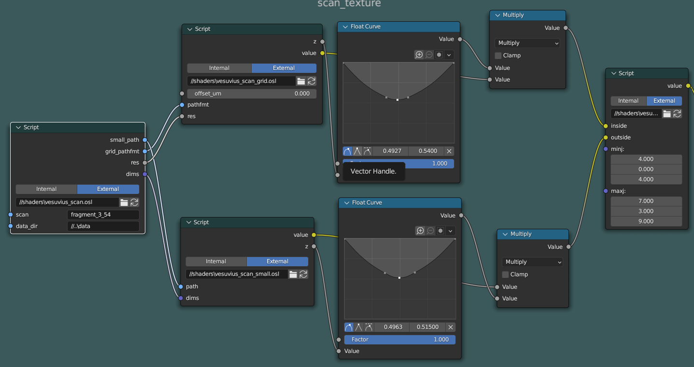
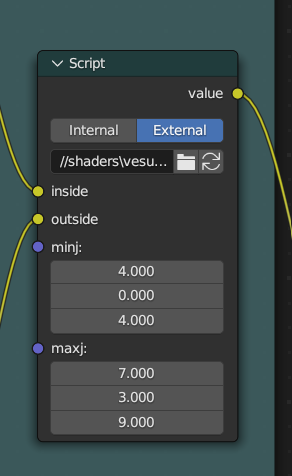
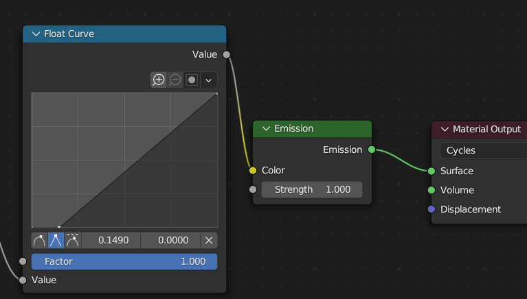

# vesuvius-blender

Explore the X-ray scans from the vesuvius challenge in blender.


## How it works

The 3d tif files produced by [vesuvius-build](https://github.com/spelufo/vesuvius-build)
are loaded as 3d textures, using blender's Cycles renderer, which works live on
the viewport in "rendered" mode.

The blender files here have a material that uses [OSL](https://docs.blender.org/manual/en/latest/render/shader_nodes/osl.html)
to sample the 3d tif files from the position in the blender scene.

Any geometry you model and assign this material will slice through the volumetric data.


## Units

```
1 blender unit/meter = 100 voxels.
5 blender units/meters = 500 voxels = 1 grid cell.
```

## Setup

You must have the textures downloaded in a data directory structured like the one
in the [server](https://scrollprize.org/data). Open the `vesuvius_scan` material
in the shader editor and set the leftmost script node `data_dir` to the path
where you keep the data. To use this on another scan, change the `scan`
parameter (`fragment_3_54`, `scroll_1_54`, etc.). There's also an `offset_um`
parameter that will offset along the mesh normals.



Adjust the grid bounds to choose a box region where the grid cells (full resolution)
will be used. Outside this region the small/downsampled texture will show.
These coordinates are cell coordinates, 1 = 500 voxels = 5 blender meters.




Outside the sampling of the textures you can map the color intensities in any
way you please. I've found it helpful to flatten the lower values a little bit
to see more contrast trying not to loose the details.




## Modeling / Sculpting / Segmentation?


I've tried some modeling of the sheets. The poly build tool is quite efficient,
but still a lot of work. You can use the live rendered mode as feedback because
the face you are modeling will light up when aligned to the sheet.

A very good way to try to gain insight into the structure of the sheets is by
modeling a sheet roughly, subdividing it, and sculpting on it. It can be
confusing at first but after a while you infer what layers of papyrus are on top
of one another.

Sculpting along papyrus strands and revealing a uniform pattern is the best way
I know of to determine you are aligned to a sheet.

Rendering out an animation can also be a way to view something in more detail
without the constant blur of rerendering in the viewport.

These techniques could be used for manual segmentation, and building the tools
into blender would save a lot of work.


## Issues

OSL only works in Cycles, and apparently using texture3d only works in CPU mode.
I'd have used GLSL and EEVEE but I think you have to recompile blender for that.
Also, Cycles seems to handle rendering big chunks of the grid really well, even
though that much data wouldn't have fit in GPU memory.

If textures are not found, you'll see a black and white gradient, there are no
warnings.

It takes several seconds the first time a grid cell is loaded. It seems to be
reading from disk a lot. It will make your computer's fan spin a lot.

The rendering lag can be tiring on the eyes. Blender doesn't freeze while the
viewport isn't rendered and you can see the wireframe before the render, so
you can keep manipulating the drawing in the dark for the second it takes the
render to finish.

There's a hack in place using a curve node to adjust the intensity of the
values from the textures, because for some reason they appear brighter in the
middle z values, and darker towards the ends.

